<h1 align="center">Hi, I'm Keivan Bolouri.</h1>

Statistics · Data science · Causal inference

  <strong><a href="https://keivanbolouri.netlify.app/profile.html">Open my full interactive profile ↗</a></strong> 
  <a href="https://keivanbolouri.netlify.app/profile.html?theme=dark">☾ Dark view</a>
  &nbsp; · &nbsp;
  <a href="https://keivanbolouri.netlify.app/profile.html?theme=light">☀ Light view</a> 
  Explore all eleven experiments and switch themes on my website.

<h3>🔎 Research Focus</h3>

I study <code>causal inference</code> through <code>statistical simulation</code> and <code>computational methods</code>, particularly how <code>missing data</code> affect conclusions from <code>observational studies</code>. My interests also include <code>machine learning</code> and <code>interpretable models</code>.

<h3>🤝 Collaboration</h3>

Open to collaborations in causal inference, missing-data methods, statistical simulation, and interpretable machine learning.

<h3>⚙️ Methods &amp; Computing</h3>

<ul>
  <li><strong>Statistical methods:</strong> linear and generalized linear models, resampling, regularization, and statistical inference.</li>
  <li><strong>Computation:</strong> Monte Carlo simulation, numerical optimization, and reproducible workflows.</li>
  <li><strong>Tools:</strong> R, Python, C++, and LaTeX.</li>
</ul>

<section id="animations">
<h2>📊 A Little Statistical Curiosity</h2>

Explore statistical ideas through simulation. Each animation opens a working experiment.

<h3><a href="https://keivanbolouri.netlify.app/profile.html#demo/monte-carlo-integration">Monte Carlo Integration</a></h3>
<a href="https://keivanbolouri.netlify.app/profile.html#demo/monte-carlo-integration">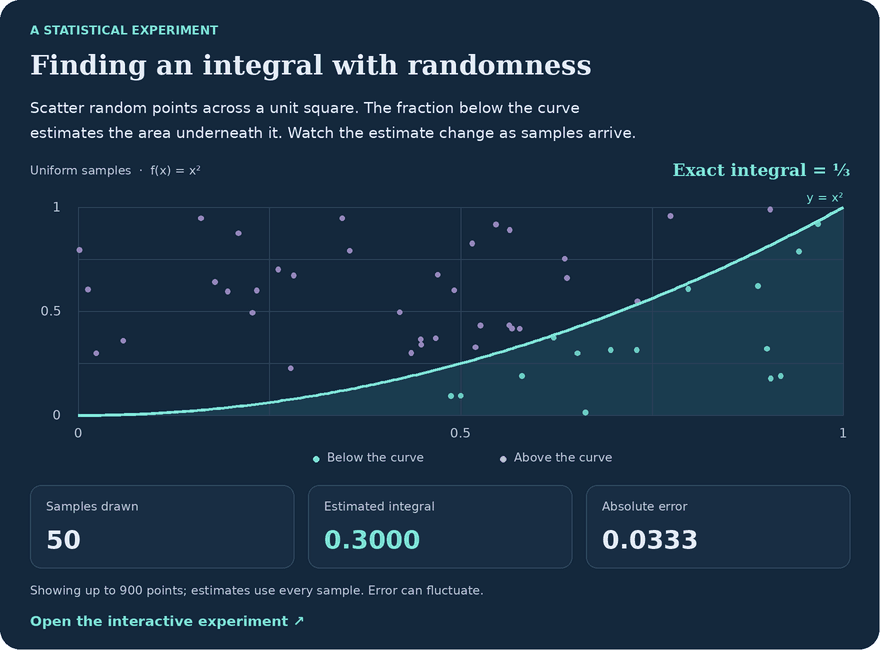</a>

Random points estimate the area under x² on [0, 1]. More samples tend to improve precision, although the error can rise or fall.

<a href="https://keivanbolouri.netlify.app/profile.html#demo/monte-carlo-integration">▶ Open the interactive experiment</a>

<strong>Explore 10 more statistical animations</strong>

<h3><a href="https://keivanbolouri.netlify.app/profile.html#demo/missing-data-simulation">What changes when observations go missing?</a></h3>
<a href="https://keivanbolouri.netlify.app/profile.html#demo/missing-data-simulation">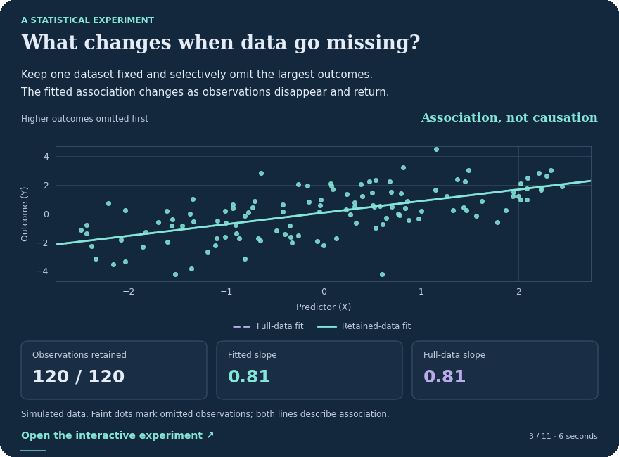</a>

See how selectively missing observations can change a fitted association. The interactive example compares random and outcome-related missingness.

<a href="https://keivanbolouri.netlify.app/profile.html#demo/missing-data-simulation">▶ Open the interactive experiment</a>

<h3><a href="https://keivanbolouri.netlify.app/profile.html#demo/lasso-coefficients">How Lasso selects variables</a></h3>
<a href="https://keivanbolouri.netlify.app/profile.html#demo/lasso-coefficients">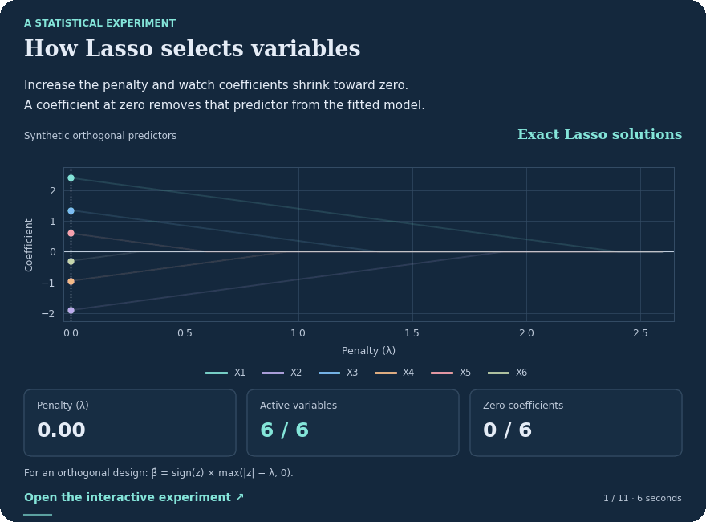</a>

Increase the penalty and watch coefficients shrink to zero in an orthogonal-design example.

<a href="https://keivanbolouri.netlify.app/profile.html#demo/lasso-coefficients">▶ Open the interactive experiment</a>

<h3><a href="https://keivanbolouri.netlify.app/profile.html#demo/bootstrap-sampling">How bootstrap sampling works</a></h3>
<a href="https://keivanbolouri.netlify.app/profile.html#demo/bootstrap-sampling">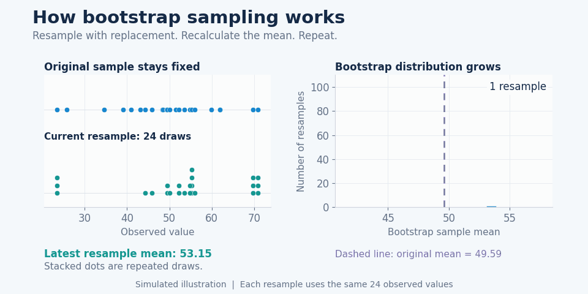</a>

Draw samples with replacement from a fixed dataset and build a distribution of sample means.

<a href="https://keivanbolouri.netlify.app/profile.html#demo/bootstrap-sampling">▶ Open the interactive experiment</a>

<h3><a href="https://keivanbolouri.netlify.app/profile.html#demo/confidence-intervals">What a confidence interval means</a></h3>
<a href="https://keivanbolouri.netlify.app/profile.html#demo/confidence-intervals">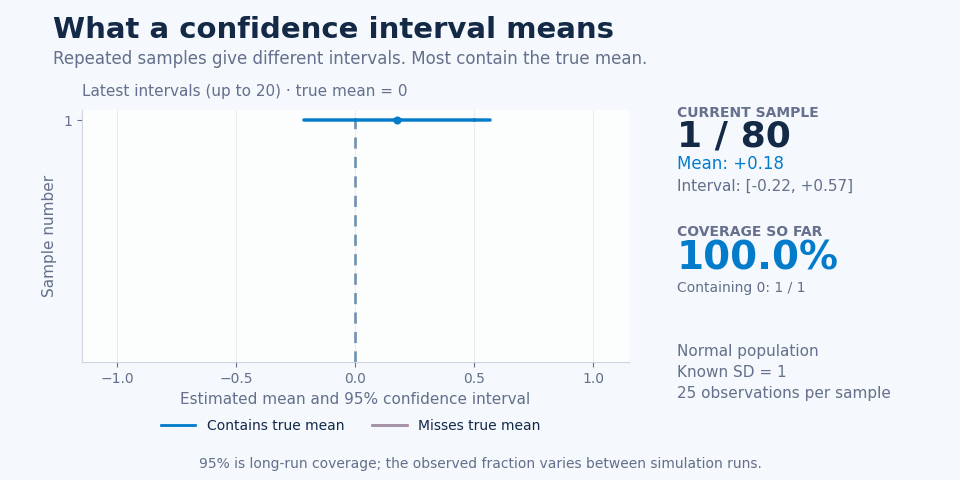</a>

Generate repeated samples and count how often their intervals contain the fixed population mean.

<a href="https://keivanbolouri.netlify.app/profile.html#demo/confidence-intervals">▶ Open the interactive experiment</a>

<h3><a href="https://keivanbolouri.netlify.app/profile.html#demo/federated-learning">How federated learning works</a></h3>
<a href="https://keivanbolouri.netlify.app/profile.html#demo/federated-learning">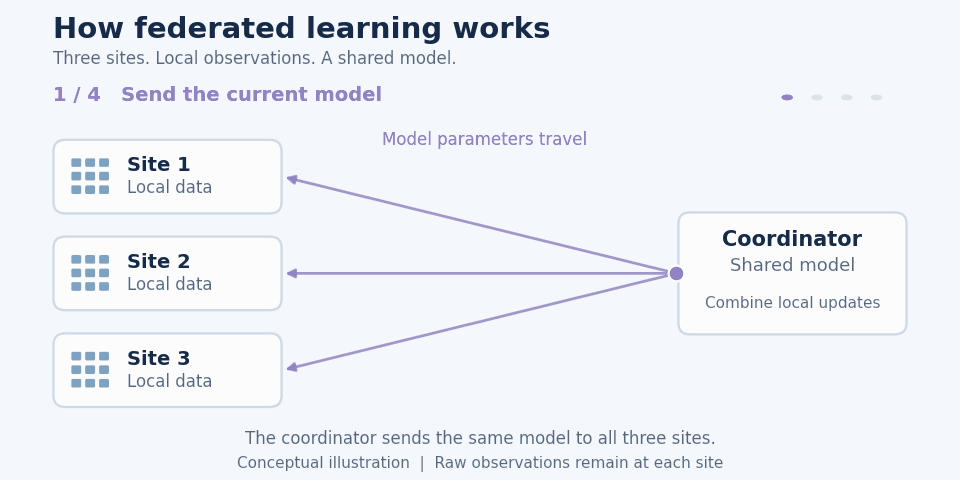</a>

Follow local model updates as three sites communicate with a coordinator and combine their results.

<a href="https://keivanbolouri.netlify.app/profile.html#demo/federated-learning">▶ Open the interactive experiment</a>

<h3><a href="https://keivanbolouri.netlify.app/profile.html#demo/gradient-descent">How optimization finds a minimum</a></h3>
<a href="https://keivanbolouri.netlify.app/profile.html#demo/gradient-descent">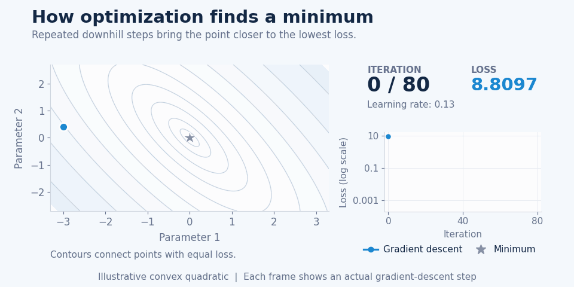</a>

Change the learning rate and follow gradient descent across a convex loss surface.

<a href="https://keivanbolouri.netlify.app/profile.html#demo/gradient-descent">▶ Open the interactive experiment</a>

<h3><a href="https://keivanbolouri.netlify.app/profile.html#demo/confounding-adjustment">Confounding and adjustment</a></h3>
<a href="https://keivanbolouri.netlify.app/profile.html#demo/confounding-adjustment">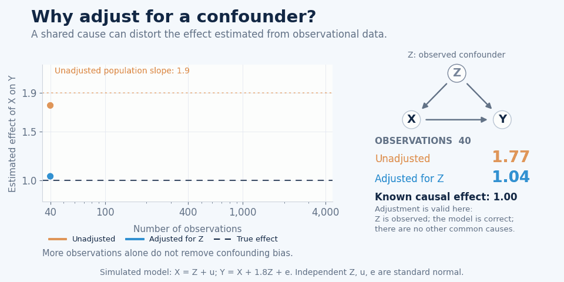</a>

Compare an unadjusted slope with an adjusted slope in a simulated model with a measured common cause.

<a href="https://keivanbolouri.netlify.app/profile.html#demo/confounding-adjustment">▶ Open the interactive experiment</a>

<h3><a href="https://keivanbolouri.netlify.app/profile.html#demo/observation-intervention">Observation versus intervention</a></h3>
<a href="https://keivanbolouri.netlify.app/profile.html#demo/observation-intervention">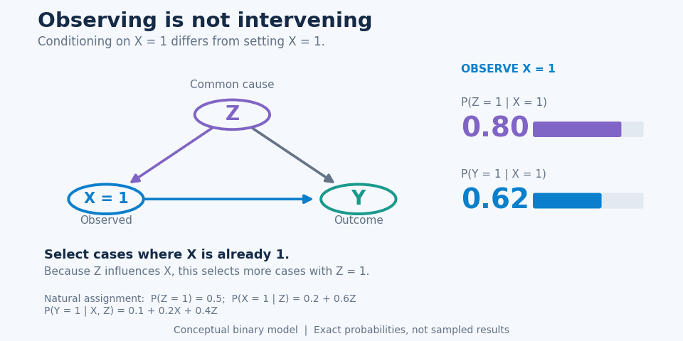</a>

Compare observing a variable with intervening to set its value in a simple causal model.

<a href="https://keivanbolouri.netlify.app/profile.html#demo/observation-intervention">▶ Open the interactive experiment</a>

<h3><a href="https://keivanbolouri.netlify.app/profile.html#demo/bayesian-updating">From prior to posterior</a></h3>
<a href="https://keivanbolouri.netlify.app/profile.html#demo/bayesian-updating">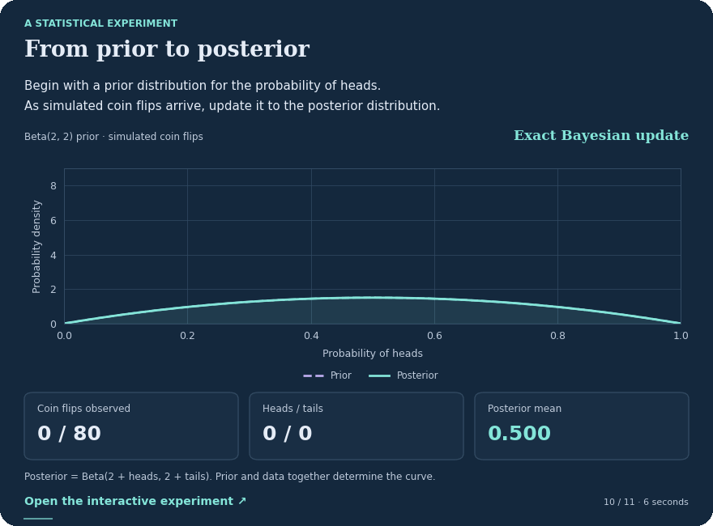</a>

Update a prior distribution as simulated coin flips arrive and see how the posterior changes.

<a href="https://keivanbolouri.netlify.app/profile.html#demo/bayesian-updating">▶ Open the interactive experiment</a>

<h3><a href="https://keivanbolouri.netlify.app/profile.html#demo/mcmc-sampling">Exploring a posterior with MCMC</a></h3>
<a href="https://keivanbolouri.netlify.app/profile.html#demo/mcmc-sampling">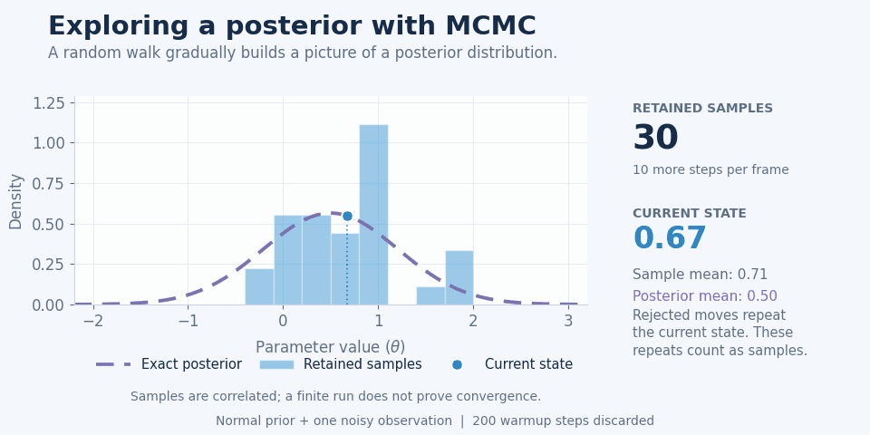</a>

Change the proposal scale and watch a Metropolis chain explore a target posterior distribution.

<a href="https://keivanbolouri.netlify.app/profile.html#demo/mcmc-sampling">▶ Open the interactive experiment</a>

</section>

<h2 align="center">⚒️ Languages, Frameworks, and Tools ⚒️</h2>

  

  <h2 align="center">🐍 My contributions in the last year 🐍</h2>
   
   
  
  

    <small>
      Example animation from <a href="https://github.com/Platane/snk">Platane/snk</a>
      · <a href="https://github.com/KeivanBolouri">View my contributions</a>
    </small>
  

     

<h2 align="center">🔬 Featured Research</h2>

  <a href="https://github.com/KeivanBolouri/pattern-aware-sequential-mar">
    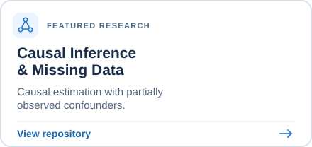
  </a>
  <a href="https://github.com/KeivanBolouri/federated-lasso">
    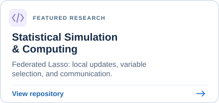
  </a>

<h2>🤝 Let’s Connect</h2>

  

  

  

 

  

  

  

